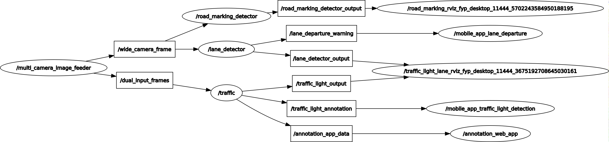
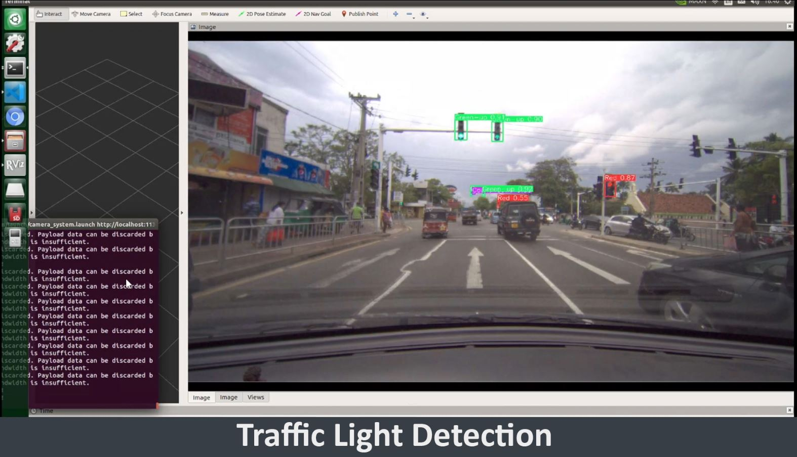
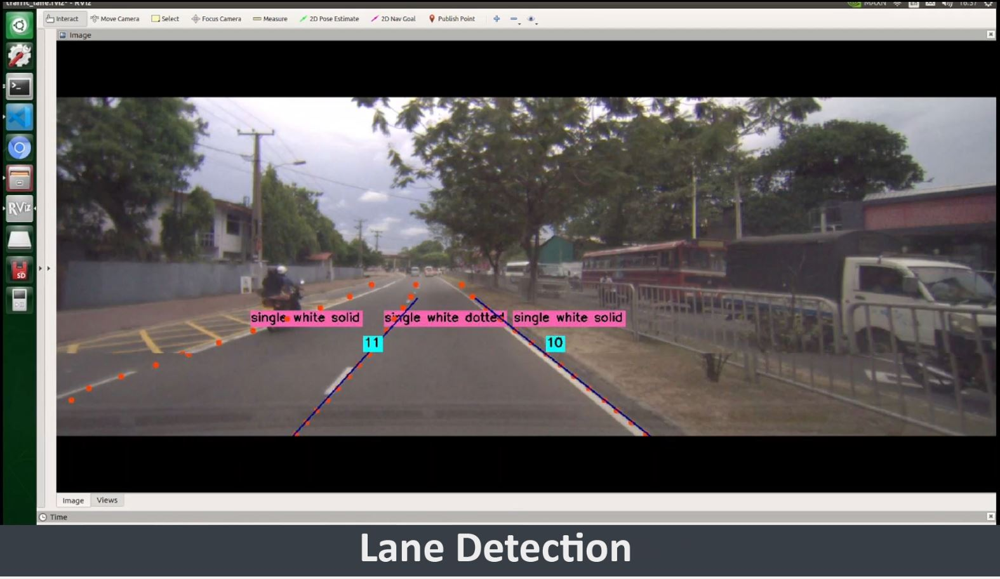
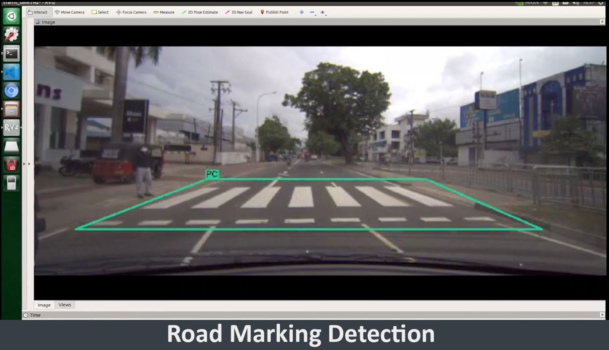

# Static Object Detection ROS System

### Packages
* [Camera_system](/camera_system)
* [lane_detector](/lane_detector)
* [road_marking_detector](/road_marking_detector)
* [traffic_light_detector](/traffic_light_detector)


### rqt graph
<p align="left" width="100%">
    
</p>

### Qualitative results
<p align="left" width="100%">
    
    
    
</p>

## How to use
* Set necessary configurations in [camera_system.launch](/camera_system/launch/camera_system.launch) file
    
```bash
    <arg name="camera_count" default="2" />   <!-- 1-single_camera_feed, 2-multi_camera_feed -->
    <arg name="camera_feed" default="false" /> <!-- true-camera_feed, false-video_feed -->

    <arg name="traffic_light_detection" default="true" />
    <arg name="lane_detection" default="true" />
    <arg name="road_marking_detection" default="true" />

    <arg name="usb_mobile_app_enable" default= "true" />
    <arg name="traffic_light_annotator_app_enable" default="true" />

    <arg name="frame_rate" default="30" />
    <arg name="narrow_AutoExposureTimeUpperLimit" default="2000" />
    <arg name="wide_AutoExposureTimeUpperLimit" default="1000" />
    
    <arg name="input_narrow_video" default="/media/fyp/sdCard/traffic_light_videos/27-02-2022_11-02_narrow_cam.mp4"/>
    <arg name="input_wide_video" default="/media/fyp/sdCard/traffic_light_videos/27-02-2022_11-02_wide_cam.mp4"/>

```

* Run the [camera_system.launch](/camera_system/launch/camera_system.launch) file.

```bash
cd ~/catkin_ws/
source devel/setup.bash
roslaunch camera_system camera_system.launch 

```
